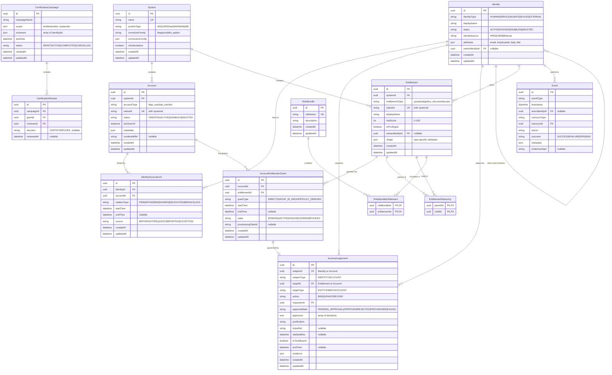
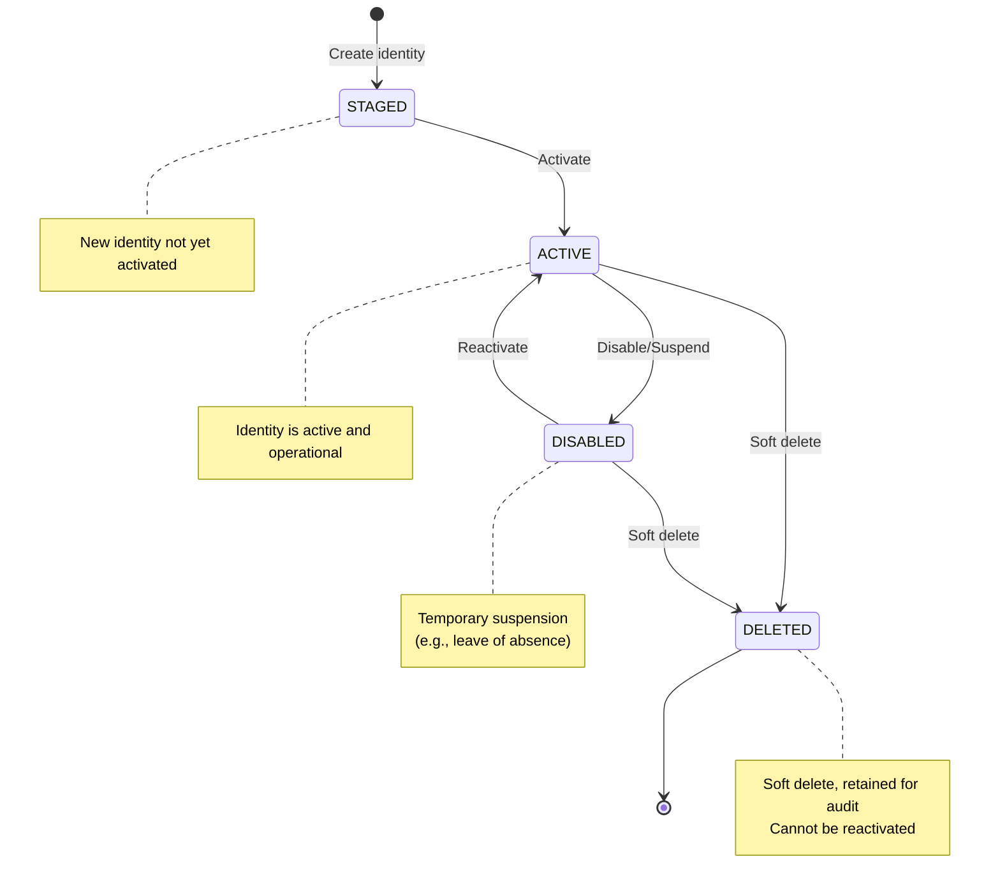
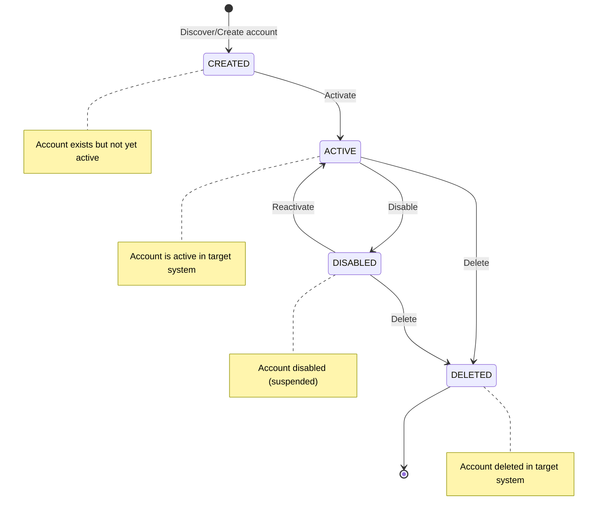
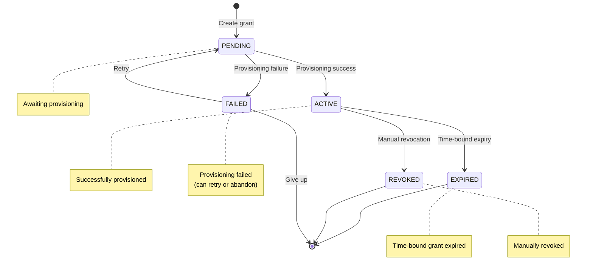
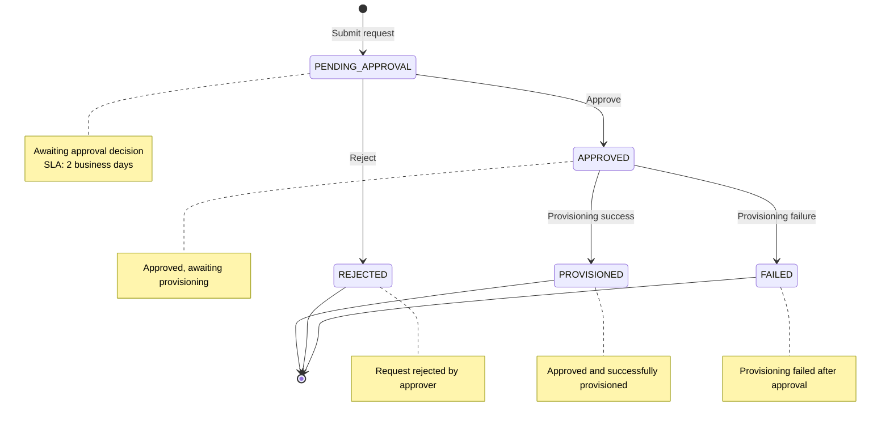
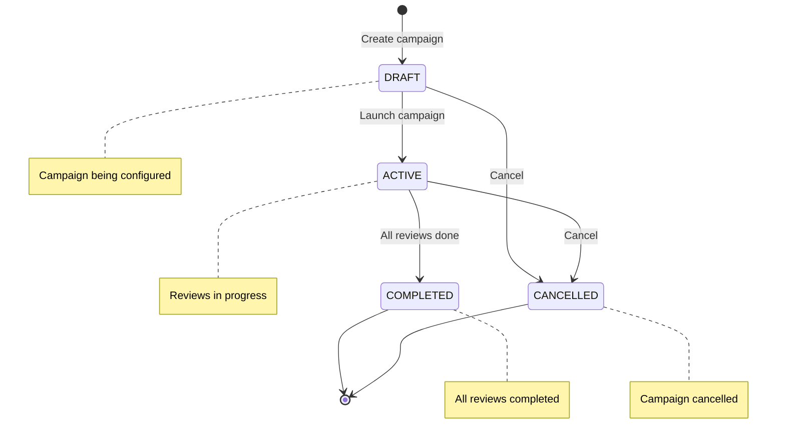
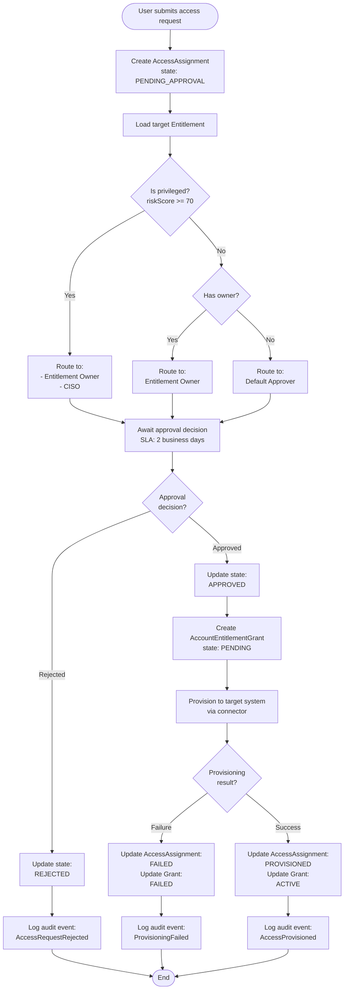
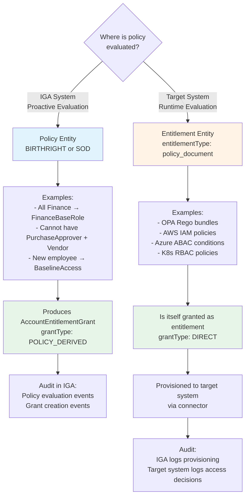

# IGA Core Data Model - Visual Diagrams

**Feature**: IGA Core Data Model
**Branch**: `001-iga-core-data-model`
**Last Updated**: 2026-01-05

This document provides visual diagrams for the data model defined in [data-model.md](data-model.md).

---

## Entity Relationship Diagram (ERD)

### Core Entities and Relationships



---

## Identity State Machine



---

## Account State Machine



---

## Grant State Machine



---

## Access Assignment State Machine



---

## Certification Campaign Status



---

## Access Request Workflow



---

## Grant Discovery and Reconciliation

```mermaid
flowchart TD
    Start([Discovery job starts]) --> ConnectSystem[Connect to target system<br/>via connector]
    ConnectSystem --> DiscoverGrants[Discover all grants<br/>discoverGrants()]

    DiscoverGrants --> ForEachGrant{For each<br/>discovered grant}

    ForEachGrant --> FindAccount[Find Account by<br/>systemId + nativeId]
    FindAccount --> AccountExists{Account<br/>exists?}

    AccountExists -->|Yes| FindEntitlement[Find Entitlement by<br/>systemId + nativeId]
    AccountExists -->|No| CreateOrphanedAccount[Flag: Orphaned account<br/>Create account record]

    CreateOrphanedAccount --> FindEntitlement

    FindEntitlement --> EntitlementExists{Entitlement<br/>exists?}

    EntitlementExists -->|Yes| CheckGrantExists[Check if grant exists<br/>accountId + entitlementId]
    EntitlementExists -->|No| CreateOrphanedEntitlement[Flag: Orphaned entitlement<br/>Create entitlement record]

    CreateOrphanedEntitlement --> CheckGrantExists

    CheckGrantExists --> GrantExists{Grant<br/>exists in DB?}

    GrantExists -->|Yes| UpdateLastSeen[Update grant.updatedAt<br/>Mark as reconciled]
    GrantExists -->|No| CreateOutOfBandGrant[Create grant with:<br/>grantType: DIRECT<br/>source: IMPORTED<br/>orphaned: true]

    CreateOutOfBandGrant --> EmitAlert[Emit alert:<br/>Out-of-band grant detected]

    UpdateLastSeen --> ForEachGrant
    EmitAlert --> ForEachGrant

    ForEachGrant -->|Done| FindStaleGrants[Find grants not seen<br/>updatedAt < 24h ago]

    FindStaleGrants --> HasStaleGrants{Found stale<br/>grants?}

    HasStaleGrants -->|Yes| MarkRevoked[Mark grants as:<br/>state: REVOKED<br/>orphaned: true]
    HasStaleGrants -->|No| LogSuccess[Log audit event:<br/>ReconciliationComplete]

    MarkRevoked --> EmitStaleAlert[Emit alert:<br/>Stale grants detected]
    EmitStaleAlert --> LogSuccess

    LogSuccess --> End([End])
```

---

## Effective Access Calculation (Graph Traversal)

```mermaid
graph LR
    Identity[Identity<br/>John Doe] -->|LINKS_TO<br/>relationType: PRIMARY| Account1[Account<br/>john.doe@ldap]
    Identity -->|LINKS_TO<br/>relationType: ADMIN| Account2[Account<br/>john.doe-admin@ldap]

    Account1 -->|HAS_GRANT<br/>grantType: DIRECT| Grant1[Grant<br/>state: ACTIVE]
    Account1 -->|HAS_GRANT<br/>grantType: GROUP_IN_GROUP| Grant2[Grant<br/>state: ACTIVE]
    Account2 -->|HAS_GRANT<br/>grantType: DIRECT| Grant3[Grant<br/>state: ACTIVE]

    Grant1 -->|GRANTS| Ent1[Entitlement<br/>Developers Group]
    Grant2 -->|GRANTS| Ent2[Entitlement<br/>Finance Users]
    Grant3 -->|GRANTS| Ent3[Entitlement<br/>Domain Admins]

    Ent1 -->|CHILD_OF| ParentEnt1[Entitlement<br/>All Employees]
    Ent2 -->|CHILD_OF| ParentEnt2[Entitlement<br/>Finance Department]

    ParentEnt2 -->|CHILD_OF| ParentEnt1

    style Identity fill:#e1f5ff
    style Account1 fill:#fff4e6
    style Account2 fill:#fff4e6
    style Grant1 fill:#e8f5e9
    style Grant2 fill:#e8f5e9
    style Grant3 fill:#e8f5e9
    style Ent1 fill:#f3e5f5
    style Ent2 fill:#f3e5f5
    style Ent3 fill:#ffebee
    style ParentEnt1 fill:#f3e5f5
    style ParentEnt2 fill:#f3e5f5
```

**Legend**:
- Blue: Identity
- Orange: Account
- Green: Grant (ACTIVE)
- Purple: Entitlement
- Red: Privileged Entitlement

**Cypher Query** (via Apache AGE):
```cypher
MATCH (identity:Identity {id: $identityId})
  -[:LINKS_TO]->(account:Account)
  -[:HAS_GRANT]->(grant:Grant {state: 'ACTIVE'})
  -[:GRANTS]->(entitlement:Entitlement)
  -[:CHILD_OF*0..5]->(parent:Entitlement)
RETURN DISTINCT parent, grant
```

---

## Policy Modeling: IGA-Evaluated vs Target-Evaluated



---

## Viewing Instructions

### In GitHub/GitLab
These Mermaid diagrams will render automatically when viewing this file in:
- GitHub
- GitLab
- VS Code (with Mermaid extension)

### In VS Code
1. Install extension: "Markdown Preview Mermaid Support"
2. Open this file
3. Press `Ctrl+Shift+V` (Windows/Linux) or `Cmd+Shift+V` (Mac) to preview

### Online Mermaid Editor
Copy any diagram to [Mermaid Live Editor](https://mermaid.live) to:
- Edit interactively
- Export as PNG/SVG
- Share via URL

### Export as Images
Using Mermaid CLI:
```bash
npm install -g @mermaid-js/mermaid-cli
mmdc -i data-model-diagrams.md -o data-model-erd.png
```

---

## References

- [data-model.md](data-model.md) - Complete data model specification
- [Mermaid Documentation](https://mermaid.js.org/)
- [Mermaid Live Editor](https://mermaid.live)
